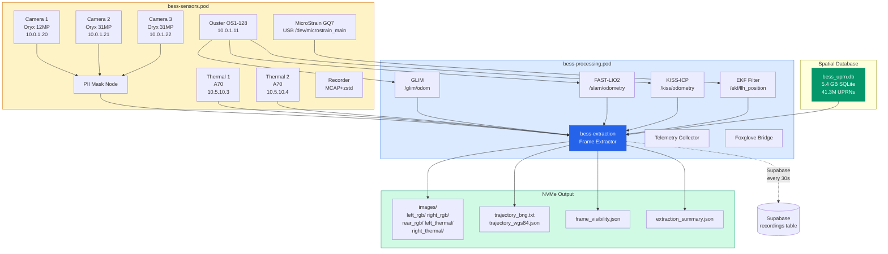
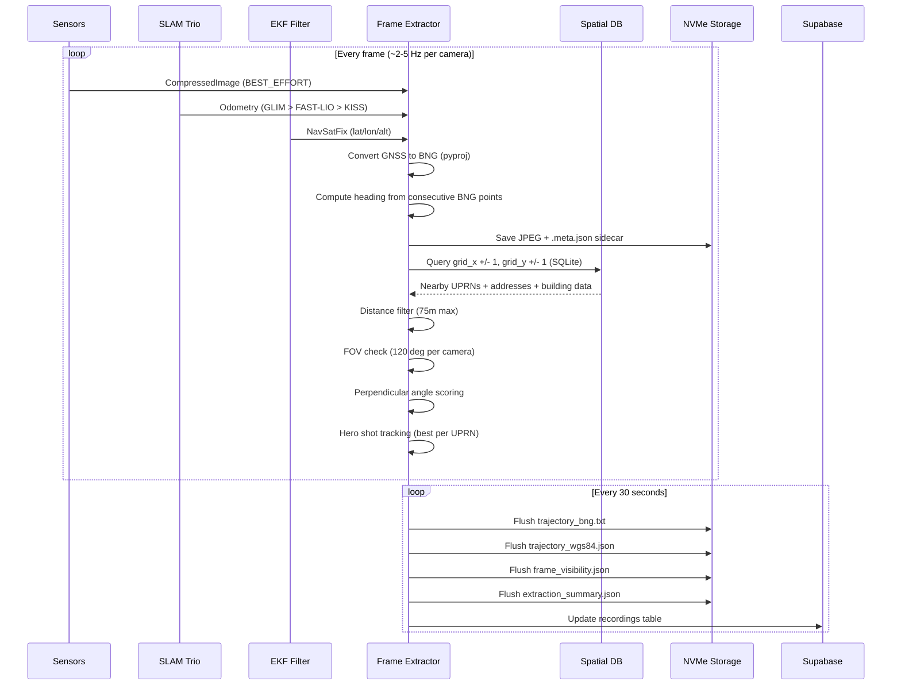
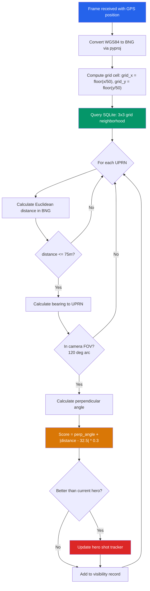
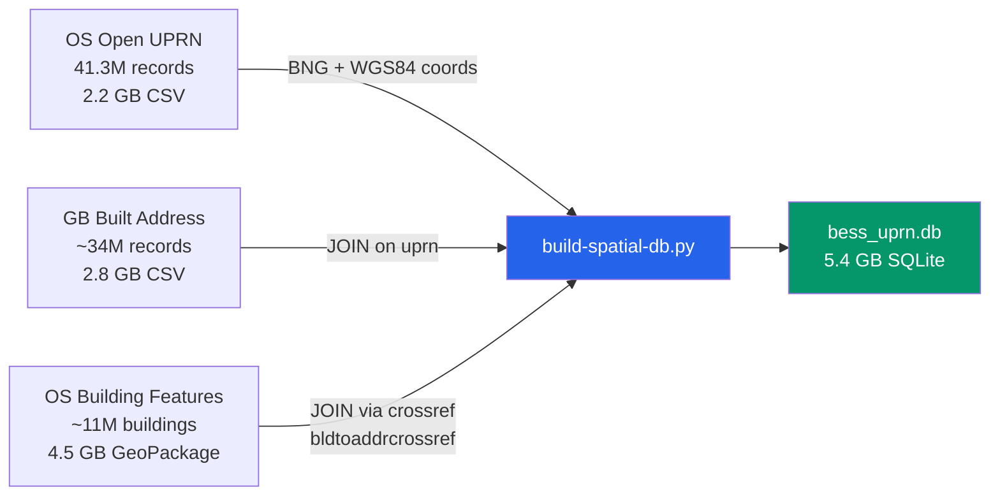
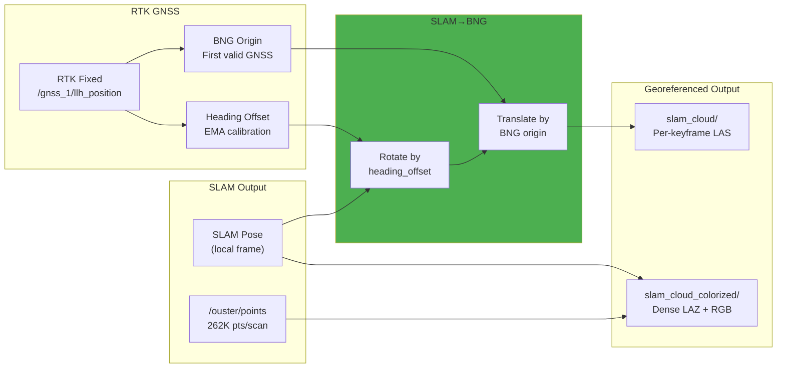
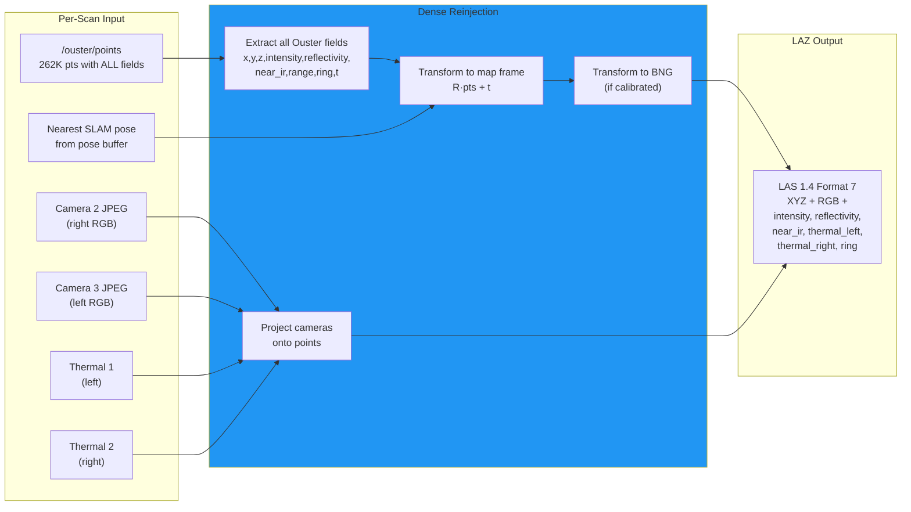
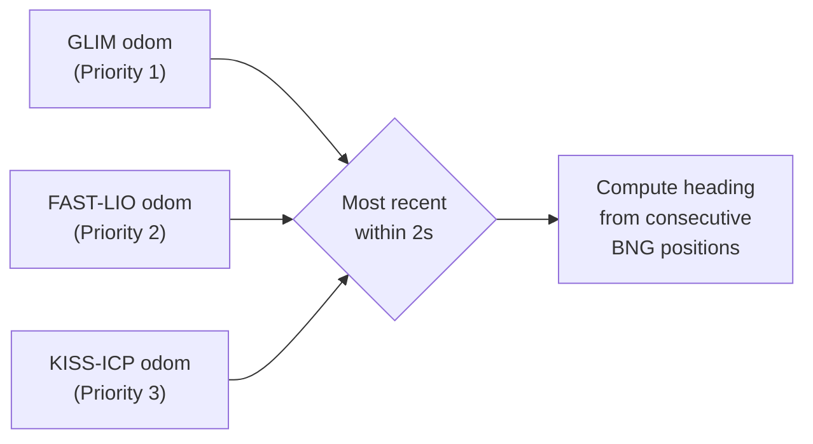

# BESS Real-Time Extraction Pipeline

> Geotagged image extraction + UPRN visibility matching + BNG-georeferenced SLAM point clouds running live on-vehicle.
> Produces MASTER-compatible output for `master.xridap.io` API consumption.

**Deployed:** 2026-02-07 | **Updated:** 2026-02-18 | **Vehicle:** BESS Grey | **Container:** `bess-extraction`

---

## System Architecture



---

## Data Flow



---

## UPRN Matching Algorithm



### Algorithm Constants

| Constant | Value | Description |
|----------|-------|-------------|
| `MAX_VISIBILITY_DISTANCE_M` | 75 | Maximum UPRN-to-vehicle distance |
| `GRID_CELL_SIZE` | 50m | SQLite grid cell size |
| `CAMERA_FOV_DEG` | 120 | Field of view per camera |
| `OPTIMAL_DISTANCE_CENTER_M` | 32.5 | Ideal distance for hero shot |
| `PERPENDICULAR_THRESHOLD_DEG` | 15 | Min perpendicular angle |
| `FLUSH_INTERVAL_S` | 30 | Output flush interval |

### Camera FOV Mapping

Side-looking cameras. `relative_angle = (heading - bearing + 360) % 360`.
90 deg = target to the LEFT, 270 deg = target to the RIGHT.

| Camera | Physical Side | FOV Center (relative) | FOV Range (relative) |
|--------|--------------|----------------------|---------------------|
| `left_rgb` | LEFT | 90 deg | 30-150 deg |
| `right_rgb` | RIGHT | 270 deg | 210-330 deg |
| `rear_rgb` | REAR | 180 deg | 120-240 deg |
| `left_thermal` (/thermal1, 89900594) | LEFT | 90 deg | 30-150 deg |
| `right_thermal` (/thermal2, 89902404) | RIGHT | 270 deg | 210-330 deg |

---

## Spatial Database

### Data Sources



### Schema

```sql
CREATE TABLE uprn_spatial (
    uprn TEXT PRIMARY KEY,       -- Unique Property Reference Number
    x REAL,                      -- BNG easting (meters)
    y REAL,                      -- BNG northing (meters)
    lat REAL,                    -- WGS84 latitude
    lon REAL,                    -- WGS84 longitude
    grid_x INTEGER,              -- floor(x / 50) for spatial indexing
    grid_y INTEGER,              -- floor(y / 50) for spatial indexing
    fulladdress TEXT,            -- e.g. "1, HIGH STREET, LONDON, SW1A 1AA"
    postcode TEXT,               -- e.g. "SW1A 1AA"
    classification TEXT,         -- e.g. "Residential", "Commercial"
    osid TEXT,                   -- OS Building Features building UUID
    building_height_m REAL,      -- Relative max height in meters
    building_floors INTEGER,     -- Number of floors
    building_age TEXT,           -- e.g. "1870-1918", "1960-1979"
    building_material TEXT,      -- e.g. "Brick Or Block Or Stone"
    building_use TEXT            -- e.g. "Residential Accommodation"
);

CREATE INDEX idx_grid ON uprn_spatial(grid_x, grid_y);
CREATE INDEX idx_postcode ON uprn_spatial(postcode);
```

### Statistics

| Metric | Count | Percentage |
|--------|-------|------------|
| Total UPRNs | 41,348,033 | 100% |
| With full address + postcode | ~5,366,355 | 13.0% |
| With building OSID | ~4,501,055 | 10.9% |
| With building height | ~4,465,900 | 10.8% |
| Grid cells (50m) | ~7,562,791 | -- |
| Avg UPRNs per cell | ~5.5 | -- |

### Build / Rebuild

```bash
python3 /opt/bess/scripts/build-spatial-db.py --spatial-dir /opt/bess/data/spatial

# Then restart extraction container to reload:
sudo systemctl restart bess-extraction
```

Build time: ~10-15 minutes on NVMe storage.

---

## Real-Time SLAM Point Clouds

### BNG Georeferencing

The extraction node performs real-time SLAM→BNG (OSGB 1936 / EPSG:27700) coordinate transformation:



**Heading offset calibration** uses RTK-quality-aware EMA:
- Only updates during RTK Fixed (status=2) with low covariance
- Compares GNSS bearing (from consecutive BNG positions) with SLAM yaw
- EMA smoothing factor α=0.1 for stable calibration
- Non-RTK periods: retains last known good offset

**CRS tagging:** All LAS/LAZ files include OGC WKT VLR (OSGB 1936 / British National Grid) for direct import into GIS tools.

### Sparse SLAM Clouds (slam_cloud/)

Per-keyframe point clouds from SLAM engines (GLIM `aligned_points_corrected`, FAST-LIO `cloud_registered`, KISS-ICP `frame`):

- **Format:** LAS 1.4 point format 6
- **Fields:** XYZ + intensity
- **Density:** ~10-40K pts per keyframe (SLAM-downsampled)
- **Rate:** 1-10 Hz depending on SLAM engine
- **Georeferencing:** BNG if RTK heading calibrated, else local SLAM frame

### Dense Colorized Clouds (slam_cloud_colorized/)

Full raw Ouster scans (262K pts) transformed using nearest SLAM pose, colorized from cameras:



- **Format:** LAZ (compressed LAS 1.4 point format 7)
- **Fields:** XYZ, RGB (from cameras), intensity, reflectivity, near-IR, thermal (left/right), ring
- **Density:** Full 262K pts per scan (2048×128 at 10Hz)
- **Rate:** Movement-gated (min 5m travel between saves, 0.5s cooldown)
- **Georeferencing:** BNG if RTK heading calibrated

### SLAM Pose Buffer

Subscribes to all three SLAM engines simultaneously and buffers poses for cloud transformation:

| Topic | Source | Priority |
|-------|--------|----------|
| `/glim/odom` | GLIM GPU | 1 (highest) |
| `/slam/odometry` | FAST-LIO | 2 |
| `/kiss/odometry` | KISS-ICP | 3 (fallback) |

Buffer: 200 poses (deque). For each raw cloud, finds nearest pose by timestamp. Whichever SLAM engine is running provides the poses.

---

## Output Format

### Directory Structure

```
/var/mnt/nvme2/extraction/
 latest -> session_bess_YYYYMMDD_HHMMSS/
    images/
        left_rgb/
            frame_20260207_120000_001.jpg
            frame_20260207_120000_001.meta.json
        right_rgb/
        rear_rgb/
        left_thermal/
        right_thermal/
        slam_cloud/
            20260207_120000_001_slam_cloud.las
        slam_cloud_colorized/
            20260207_120000_001_slam_colorized.laz
    trajectory_bng.txt
    trajectory_wgs84.json
    frame_visibility.json
    extraction_summary.json
```

### Image Metadata Sidecar (.meta.json)

```json
{
    "timestamp": "2026-02-07T12:00:00.123456Z",
    "camera": "left_rgb",
    "lat": 51.507400,
    "lon": -0.127800,
    "alt": 12.5,
    "bng_x": 530234.5,
    "bng_y": 180456.2,
    "heading": 45.2,
    "slam_source": "glim"
}
```

### trajectory_bng.txt

```
# timestamp,x,y,heading,source
1770501535.123,530234.5,180456.2,45.2,glim
1770501535.623,530235.1,180457.8,45.5,glim
1770501536.123,530236.2,180459.1,46.1,fast_lio
```

### trajectory_wgs84.json

```json
[
    {"ts": 1770501535.123, "lat": 51.5074, "lon": -0.1278, "heading": 45.2, "source": "glim"},
    {"ts": 1770501535.623, "lat": 51.5074, "lon": -0.1278, "heading": 45.5, "source": "glim"}
]
```

### frame_visibility.json (MASTER Stage 9b format)

```json
{
    "frames": [
        {
            "frame_id": "left_rgb_frame_20260207_120000_001",
            "camera": "left_rgb",
            "timestamp": "2026-02-07T12:00:00.123Z",
            "lat": 51.5074,
            "lon": -0.1278,
            "heading": 45.2,
            "visible_uprns": [
                {
                    "uprn": "12345678",
                    "distance_m": 28.4,
                    "bearing_deg": 315.2,
                    "perpendicular_angle": 82.1,
                    "fulladdress": "1, HIGH STREET, LONDON, SW1A 1AA",
                    "postcode": "SW1A 1AA",
                    "classification": "Residential",
                    "building_height_m": 12.5,
                    "building_floors": 3,
                    "building_use": "Residential Accommodation"
                }
            ]
        }
    ],
    "heroes": {
        "12345678": {
            "frame_id": "left_rgb_frame_20260207_120000_001",
            "camera": "left_rgb",
            "distance_m": 28.4,
            "perpendicular_angle": 82.1,
            "score": 82.4,
            "fulladdress": "1, HIGH STREET, LONDON, SW1A 1AA",
            "postcode": "SW1A 1AA",
            "building_height_m": 12.5,
            "building_floors": 3,
            "building_use": "Residential Accommodation"
        }
    },
    "metadata": {
        "session": "session_bess_20260207_120000",
        "rig_id": "bess_grey",
        "total_frames": 1234,
        "total_uprns_seen": 567,
        "total_heroes": 234
    }
}
```

### extraction_summary.json

```json
{
    "session": "session_bess_20260207_120000",
    "rig_id": "bess_grey",
    "start_time": "2026-02-07T12:00:00Z",
    "total_frames": 1234,
    "frames_by_camera": {
        "left_rgb": 400,
        "right_rgb": 400,
        "rear_rgb": 400,
        "left_thermal": 17,
        "right_thermal": 17
    },
    "total_uprns_seen": 567,
    "total_heroes": 234,
    "trajectory_points": 2400,
    "slam_sources_used": ["glim", "fast_lio"],
    "spatial_db_available": true,
    "spatial_db_uprns": 41348033,
    "slam_cloud_count": 156,
    "slam_cloud_total_points": 4800000,
    "georeferenced": true,
    "heading_offset_deg": 132.5,
    "heading_offset_rtk_samples": 847,
    "crs": "OSGB 1936 / British National Grid"
}
```

---

## Container Configuration

### Quadlet Unit

**File:** `/etc/containers/systemd/bess-extraction.container`

```ini
[Unit]
Description=BESS Real-Time Frame Extraction
After=bess-processing.service

[Container]
ContainerName=bess-extraction
Image=localhost/bess-extraction:humble
Pod=bess-processing.pod
PullPolicy=never
SecurityLabelDisable=true

# Mounts
Volume=/opt/bess/config/fastdds.xml:/opt/fastdds.xml:ro,z
Volume=/var/mnt/nvme2/extraction:/data/extraction:rw,z
Volume=/opt/bess/config/extraction:/config:ro,z
Volume=/opt/bess/data/spatial:/data/spatial:ro,z

# Environment
Environment=ROS_DOMAIN_ID=0
Environment=RMW_IMPLEMENTATION=rmw_fastrtps_cpp
Environment=FASTRTPS_DEFAULT_PROFILES_FILE=/opt/fastdds.xml
Environment=SPATIAL_DB=/data/spatial/bess_uprn.db
Environment=EXTRACTION_DIR=/data/extraction
EnvironmentFile=/opt/bess/config/supabase.env

# Health check
HealthCmd=/bin/bash -c 'test -f /data/extraction/latest/extraction_summary.json'
HealthInterval=60s
HealthRetries=3
HealthStartPeriod=120s
HealthTimeout=10s

[Service]
Restart=always
RestartSec=15
TimeoutStartSec=120

[Install]
WantedBy=default.target
```

### Containerfile

**File:** `/opt/bess/dockerfiles/extraction/Containerfile`

```dockerfile
FROM docker.io/ros:humble-ros-base
RUN apt-get update && apt-get install -y --no-install-recommends \
    python3-pip ros-humble-cv-bridge ros-humble-compressed-image-transport \
    && rm -rf /var/lib/apt/lists/*
RUN pip3 install --no-cache-dir pyproj numpy
COPY bess-extraction.py /ros2_ws/bess-extraction.py
COPY entrypoint.sh /entrypoint.sh
RUN chmod +x /entrypoint.sh
ENTRYPOINT ["/entrypoint.sh"]
CMD ["python3", "/ros2_ws/bess-extraction.py"]
```

### Camera Topic Mapping

**File:** `/opt/bess/config/extraction/cameras.yaml`

```yaml
left_rgb: /camera1/camera_driver/image_masked/compressed
right_rgb: /camera2/camera_driver/image_masked/compressed
rear_rgb: /camera3/camera_driver/image_masked/compressed
left_thermal: /thermal1/camera_driver/image_raw/compressed
right_thermal: /thermal2/camera_driver/image_raw/compressed
```

---

## ROS2 Topic Subscriptions

| Topic | Type | QoS | Purpose |
|-------|------|-----|---------|
| `/glim/odom` | `nav_msgs/Odometry` | BEST_EFFORT | Primary SLAM odometry (priority 1) |
| `/slam/odometry` | `nav_msgs/Odometry` | BEST_EFFORT | FAST-LIO odometry (priority 2) |
| `/kiss/odometry` | `nav_msgs/Odometry` | BEST_EFFORT | KISS-ICP odometry (priority 3) |
| `/glim/aligned_points_corrected` | `sensor_msgs/PointCloud2` | BEST_EFFORT | GLIM sparse keyframes |
| `/slam/cloud_registered` | `sensor_msgs/PointCloud2` | BEST_EFFORT | FAST-LIO sparse clouds |
| `/kiss/frame` | `sensor_msgs/PointCloud2` | BEST_EFFORT | KISS-ICP per-scan frames |
| `/ouster/points` | `sensor_msgs/PointCloud2` | BEST_EFFORT | Raw 262K pts for dense reinjection |
| `/ekf/llh_position` | `sensor_msgs/NavSatFix` | BEST_EFFORT | GNSS position + heading cal |
| `/camera[1-3]/.../compressed` | `sensor_msgs/CompressedImage` | BEST_EFFORT | RGB frames |
| `/thermal[1-2]/.../compressed` | `sensor_msgs/CompressedImage` | BEST_EFFORT | Thermal frames |

### SLAM Priority



The node subscribes to all three SLAM sources simultaneously. For each image frame, it uses the most recent odometry from the highest-priority source that has published within the last 2 seconds.

---

## Operations

### Start / Stop / Restart

```bash
# Start
sudo systemctl start bess-extraction

# Stop
sudo systemctl stop bess-extraction

# Restart (e.g., after config change)
sudo systemctl restart bess-extraction

# Check status
sudo systemctl status bess-extraction

# View logs (live)
sudo podman logs -f bess-extraction
```

### Rebuild Container Image

```bash
# 1. Edit extraction script
vim /opt/bess/scripts/bess-extraction.py

# 2. Copy to build context
cp /opt/bess/scripts/bess-extraction.py /opt/bess/dockerfiles/extraction/

# 3. Build under root (IMPORTANT: must use sudo)
sudo podman build -t localhost/bess-extraction:humble \
    -f /opt/bess/dockerfiles/extraction/Containerfile \
    /opt/bess/dockerfiles/extraction/

# 4. Restart service
sudo systemctl restart bess-extraction
```

### Rebuild Spatial Database

```bash
# After updating source data in /opt/bess/data/spatial/
python3 /opt/bess/scripts/build-spatial-db.py --spatial-dir /opt/bess/data/spatial

# Restart extraction to reload (mounted read-only with immutable=1)
sudo systemctl restart bess-extraction
```

### Check Extraction Output

```bash
# Current session directory
ls -la /var/mnt/nvme2/extraction/latest/

# Image counts per camera
for d in /var/mnt/nvme2/extraction/latest/images/*/; do
    echo "$(basename $d): $(ls $d/*.jpg 2>/dev/null | wc -l) images"
done

# Latest frame_visibility.json stats
python3 -c "
import json
with open('/var/mnt/nvme2/extraction/latest/frame_visibility.json') as f:
    d = json.load(f)
print(f'Frames: {len(d[\"frames\"])}')
print(f'Heroes: {len(d[\"heroes\"])}')
print(f'Total UPRNs seen: {d[\"metadata\"][\"total_uprns_seen\"]}')
"

# Trajectory point count
wc -l /var/mnt/nvme2/extraction/latest/trajectory_bng.txt
```

---

## Troubleshooting

### Container won't start

```bash
# Check for image under root namespace (systemd runs as root)
sudo podman images | grep extraction

# If missing, rebuild under sudo (user images are invisible to root)
sudo podman build -t localhost/bess-extraction:humble \
    -f /opt/bess/dockerfiles/extraction/Containerfile \
    /opt/bess/dockerfiles/extraction/
```

### spatial_db=no in logs

The spatial volume is mounted read-only. SQLite uses `immutable=1` URI mode to avoid journal file creation:

```python
sqlite3.connect('file:///path/to/db?mode=ro&immutable=1', uri=True)
```

If the DB file doesn't exist or is corrupted, rebuild it:

```bash
python3 /opt/bess/scripts/build-spatial-db.py --spatial-dir /opt/bess/data/spatial
sudo systemctl restart bess-extraction
```

### No frames being extracted (0 images)

1. **Sensors offline:** Check camera/ouster/microstrain containers
   ```bash
   sudo podman ps --format '{{.Names}} {{.Status}}' | grep -E 'camera|ouster|micro'
   ```

2. **DDS transport:** Verify FastDDS UDP config is mounted
   ```bash
   sudo podman exec bess-extraction cat /opt/fastdds.xml
   # Should show UDP-only transport, no SHM
   ```

3. **Topic data flow:** Test from inside the container
   ```bash
   sudo podman exec bess-extraction bash -c '
       source /opt/ros/humble/setup.bash
       timeout 5 ros2 topic hz /camera1/camera_driver/image_masked/compressed'
   ```

### Hero shot quality is poor

Tune constants in `bess-extraction.py`:

- Increase `MAX_VISIBILITY_DISTANCE_M` for wider coverage (costs more DB queries)
- Adjust `OPTIMAL_DISTANCE_CENTER_M` for different street widths
- Modify FOV ranges in `_get_fov_range()` for different camera configurations

---

## File Inventory

| Path | Type | Description |
|------|------|-------------|
| `/opt/bess/scripts/bess-extraction.py` | Python (~2300 lines) | Main ROS2 extraction node + SLAM clouds + BNG georef |
| `/opt/bess/scripts/build-spatial-db.py` | Python (294 lines) | Spatial DB builder |
| `/opt/bess/dockerfiles/extraction/Containerfile` | Dockerfile | Container image definition |
| `/opt/bess/dockerfiles/extraction/entrypoint.sh` | Shell | ROS2 setup entrypoint |
| `/opt/bess/config/extraction/cameras.yaml` | YAML | Camera topic mapping |
| `/etc/containers/systemd/bess-extraction.container` | Quadlet | Systemd container unit |
| `/opt/bess/data/spatial/bess_uprn.db` | SQLite (5.4G) | Pre-built UPRN spatial database |
| `/opt/bess/data/spatial/osopenuprn.csv` | CSV (2.2G) | OS Open UPRN source data |
| `/opt/bess/data/spatial/bld_fts_building.gpkg` | GeoPackage (4.5G) | OS Building Features source |
| `/opt/bess/data/spatial/add_gb_builtaddress.csv` | CSV (2.8G) | GB Built Address source |
| `/var/mnt/nvme2/extraction/` | Directory | Runtime output (images + metadata) |

---

## MASTER Pipeline Compatibility

This pipeline produces output that matches MASTER pipeline conventions:

| MASTER Stage | Equivalent | Notes |
|-------------|------------|-------|
| Stage 6 (extract_multi_sensor.py) | `bess-extraction.py` image saving | Same JPEG + sidecar pattern |
| Stage 9b (index_bag_assets.py) | `bess-extraction.py` UPRN matching | Same algorithm: grid query, distance, FOV, perp angle, hero scoring |
| frame_visibility.json | frame_visibility.json | Identical format: frames[], heroes{}, metadata{} |
| trajectory files | trajectory_bng.txt + trajectory_wgs84.json | BNG + WGS84 dual format |

The key difference: MASTER runs post-hoc on recorded bags. This pipeline runs in **real-time** on the vehicle, producing the same output as the vehicle drives.
